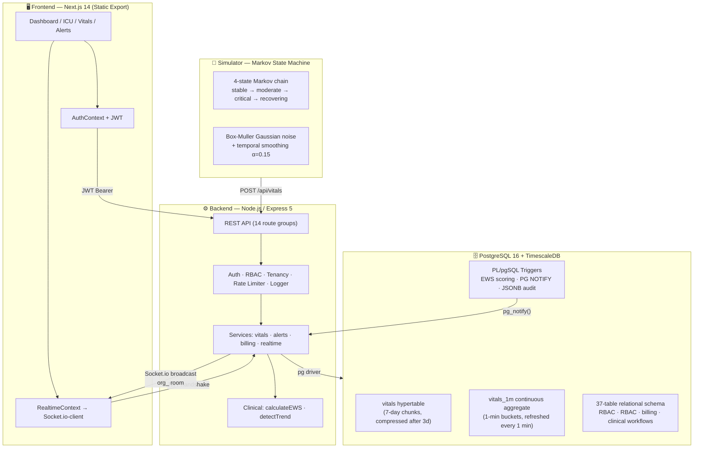
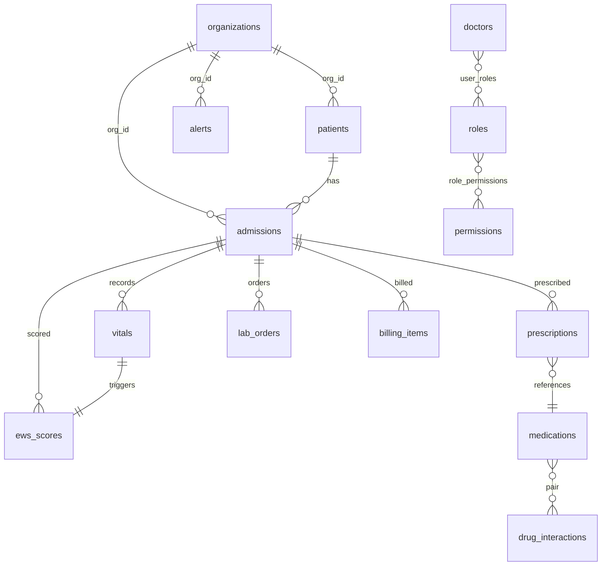
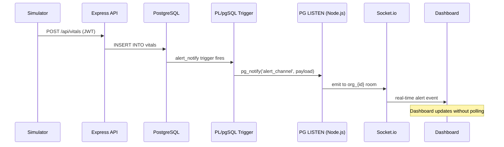
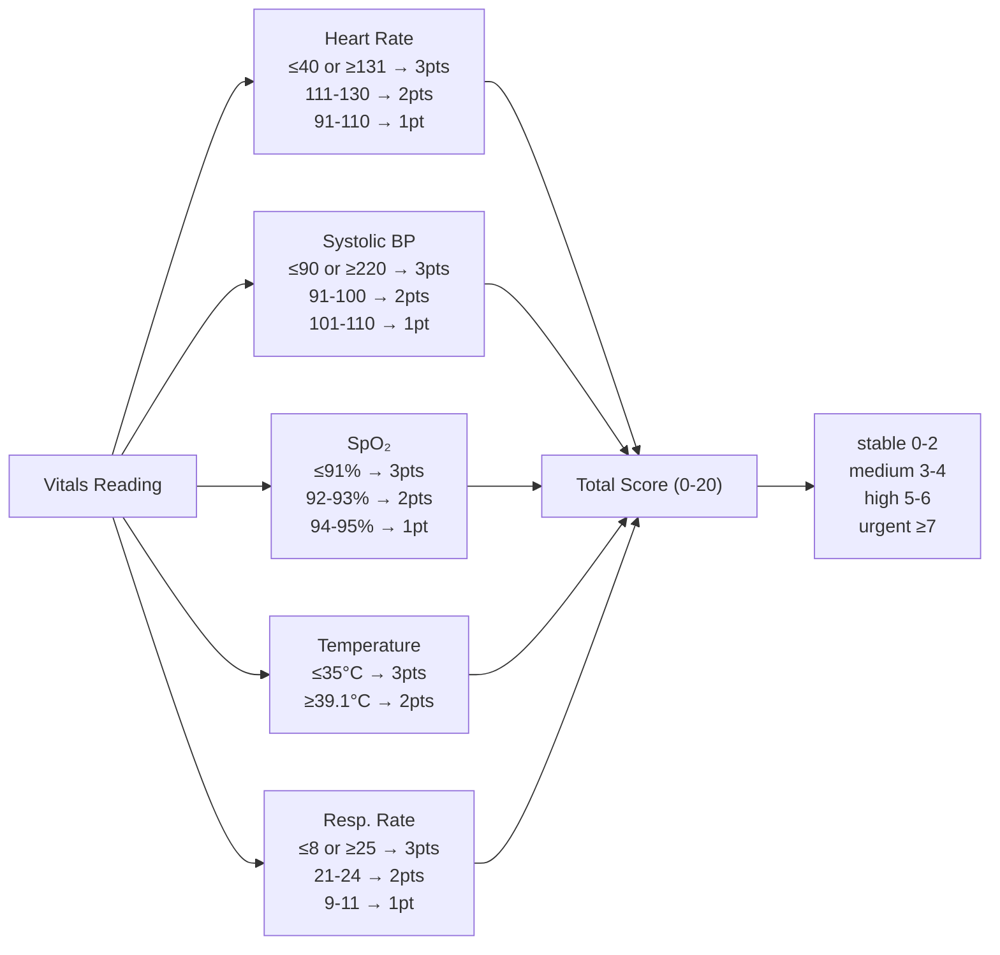
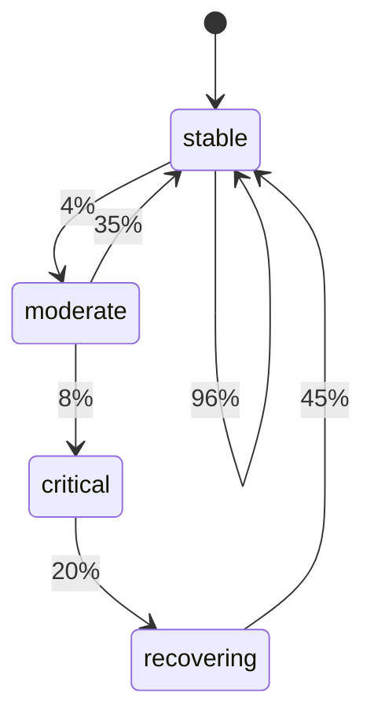
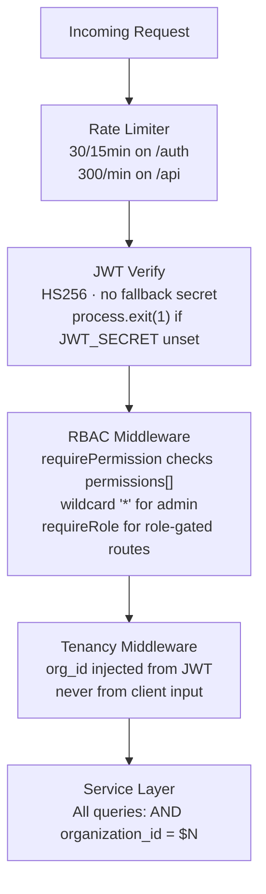

<div align="center">

# 🏥 IntelliCare
### Clinical Database Intelligence Platform

*A production-grade, full-stack hospital intelligence system built on TimescaleDB, real-time WebSocket pipelines, and evidence-based clinical algorithms.*

<br/>

[](https://nodejs.org)
[](https://postgresql.org)
[](https://timescale.com)
[](https://nextjs.org)
[](https://typescriptlang.org)
[](https://docker.com)
[](./backend/src/__tests__)
[](./LICENSE)

<br/>

> **Every feature documented here exists in the committed code. No inflated claims.**

</div>

---

## Table of Contents

- [Overview](#overview)
- [System Architecture](#system-architecture)
- [Database Design](#database-design)
- [Real-Time Pipeline](#real-time-pipeline)
- [Clinical Algorithms](#clinical-algorithms)
- [Security Model](#security-model)
- [API Reference](#api-reference)
- [Tech Stack](#tech-stack)
- [Quickstart](#quickstart)
- [Testing](#testing)
- [Project Structure](#project-structure)
- [Honest Limitations](#honest-limitations)

---

## Overview

IntelliCare is a multi-tenant hospital command center that integrates:

- **Relational data** (patients, admissions, RBAC, billing) in PostgreSQL
- **Time-series telemetry** (patient vitals at IoT frequency) in TimescaleDB hypertables
- **Real-time alerting** via PostgreSQL PG NOTIFY → Socket.io — no polling
- **Evidence-based clinical scoring** using the NHS NEWS2 Early Warning Score standard
- **Physiologically realistic simulation** via a Markov state-machine vitals generator

---

## System Architecture



---

## Database Design

### Schema Overview

37 sequential SQL migrations — no ORM, raw PL/pgSQL. Every migration is idempotent (`IF NOT EXISTS`).



### TimescaleDB Hypertable — `vitals`

```sql
-- Append-only, partitioned by time (7-day chunks)
SELECT create_hypertable('vitals', 'recorded_at');

-- Columnar compression on cold data (saves ~10× storage)
SELECT add_compression_policy('vitals', INTERVAL '3 days');
```

### Continuous Aggregate — `vitals_1m`

Pre-computes per-minute averages. The dashboard aggregation endpoint queries **~60 rows/hour** instead of thousands of raw readings.

```sql
CREATE MATERIALIZED VIEW vitals_1m
WITH (timescaledb.continuous) AS
SELECT time_bucket('1 minute', recorded_at) AS bucket,
       admission_id,
       ROUND(AVG(heart_rate))    AS avg_hr,
       ROUND(AVG(systolic_bp))   AS avg_sys,
       ROUND(AVG(spo2), 2)       AS avg_spo2,
       ROUND(AVG(temperature),1) AS avg_temp
FROM vitals
GROUP BY bucket, admission_id;

-- Refreshes every 60 seconds, 1-day lookback
SELECT add_continuous_aggregate_policy('vitals_1m',
  start_offset => INTERVAL '1 day',
  end_offset   => INTERVAL '1 minute',
  schedule_interval => INTERVAL '1 minute');
```

### Performance Indexes

| Index | Type | Purpose |
|---|---|---|
| `(org_id, status, admitted_at DESC)` | B-tree | Active admission queries |
| `(org_id, is_acknowledged) WHERE NOT acknowledged` | Partial B-tree | Unacknowledged alert lookups |
| `(admission_id, calculated_at DESC)` | B-tree | Latest EWS score per patient |
| `(drug1_id), (drug2_id)` | B-tree | Drug interaction pair lookups |
| `name gin_trgm_ops` | GIN / pg_trgm | Patient name free-text search |
| Covering: `(org_id, status, admitted_at) INCLUDE (patient_id, doctor_id, ...)` | Covering B-tree | Index-only admission scans |

---

## Real-Time Pipeline



**Key design decisions:**
- The PG LISTEN client is a **dedicated `pg.Client`**, separate from the connection pool — its only job is to hold the LISTEN subscription
- The Socket.io org room (`org_{id}`) is assigned **server-side** after JWT verification — the client cannot join an arbitrary room
- The listener reconnects automatically with a 5-second delay on connection drop

---

## Clinical Algorithms

### NEWS2 Early Warning Score

Implements the **NHS National Early Warning Score 2** — a validated, published clinical standard used in hospitals across the UK.



Implemented **twice** — independently — and must agree:
- `backend/src/functions/clinical/calculateEWS.js` — Node.js (API layer)
- `backend/src/db/functions/007_ews_trigger.sql` — PL/pgSQL (fires on every INSERT, configurable per-org thresholds)

### OLS Trend Detection

Replaces naive first-vs-last delta with **Ordinary Least Squares linear regression** across the 10 most recent readings.

```
slope, R² = OLS(vital_values over time)

Deteriorating IF:
  slope > threshold   (e.g. HR rising >3 bpm/reading)
  AND R² ≥ 0.40       (40% variance explained by time — not noise)
```

| Vital | Rising threshold | Falling threshold |
|---|---|---|
| Heart Rate | > 3.0 bpm/reading | — |
| SpO₂ | — | < −0.5 %/reading |
| Systolic BP | — | < −3.0 mmHg/reading |
| Respiratory Rate | > 1.5 /min/reading | — |
| Temperature | > 0.15 °C/reading | — |

The R² gate prevents noisy data from triggering false alarms. A patient can have a normal EWS score and a rising trend — the trend detection catches early deterioration **before** thresholds are breached.

### Markov-Chain Vitals Simulator



Each transition applies:
1. **Box-Muller Gaussian noise** — per-vital sigma tuned per state
2. **Temporal smoothing** — `next = 0.15 × target + 0.85 × current + noise`
3. **3% artefact injection** — random spike to simulate sensor dropout

---

## Security Model



| Concern | Implementation |
|---|---|
| Authentication | JWT HS256, `jsonwebtoken`, configurable expiry |
| Passwords | `bcryptjs` hash + verify, no plaintext storage |
| JWT secret | Required env var — `process.exit(1)` at startup if missing |
| Demo accounts | Allow-listed 4 email addresses, disabled when `NODE_ENV=production` |
| Rate limiting | `express-rate-limit` — 30 req/15 min on `/auth`, 300 req/min on `/api` |
| Multi-tenancy | Application-layer `org_id` on every query (see [limitations](#honest-limitations)) |
| Audit log | PL/pgSQL trigger writes JSONB snapshots on critical table mutations |
| WebSocket | JWT verified on `connection`; org room assigned server-side from token |

---

## API Reference

### Authentication
| Method | Endpoint | Description |
|---|---|---|
| `POST` | `/api/auth/login` | JWT login |
| `POST` | `/api/auth/logout` | Logout |

### Vitals & Clinical
| Method | Endpoint | Auth | Description |
|---|---|---|---|
| `POST` | `/api/vitals` | `RECORD_VITALS` | Record vitals reading → triggers EWS |
| `GET` | `/api/vitals/history/:admissionId` | `VIEW_VITALS` | Raw readings from hypertable |
| `GET` | `/api/vitals/aggregate/:admissionId` | `VIEW_VITALS` | 1-min buckets from `vitals_1m` |
| `GET` | `/api/vitals/trend/:admissionId` | `VIEW_VITALS` | OLS regression result + R² |
| `GET` | `/api/vitals/latest/:admissionId` | `VIEW_VITALS` | Most recent reading |

### Alerts
| Method | Endpoint | Auth | Description |
|---|---|---|---|
| `GET` | `/api/alerts` | `VIEW_ALERTS` | Active alerts for org |
| `PATCH` | `/api/alerts/:id/acknowledge` | `ACKNOWLEDGE_ALERT` | Acknowledge alert |
| `POST` | `/api/alerts/:id/escalate` | `ESCALATE_ALERT` | Escalate to senior staff |

### Prescriptions
| Method | Endpoint | Description |
|---|---|---|
| `POST` | `/api/prescriptions` | Create (auto-checks drug interactions) |
| `POST` | `/api/prescriptions/check` | Interaction check only |
| `GET` | `/api/prescriptions/:patientId` | Patient prescription history |

### Observability
| Method | Endpoint | Description |
|---|---|---|
| `GET` | `/health` | Liveness probe + uptime |
| `GET` | `/metrics` | In-process counters (vitals, alerts, WS connections, requests) |

---

## Tech Stack

| Layer | Technology | Version | Why |
|---|---|---|---|
| Frontend | Next.js (App Router) | 14 | Static export; RBAC-aware routing |
| UI | React + Tailwind CSS + Recharts | 18 | Real-time chart updates |
| Backend | Node.js + Express | 18 / 5 | Native async error propagation in Express 5 |
| WebSockets | Socket.io | 4 | Org-room isolation; JWT handshake auth |
| Database | PostgreSQL + TimescaleDB | 16 / 2.x | Hypertables + continuous aggregates |
| DB Client | node-postgres (`pg`) | 8 | Raw SQL — no ORM abstraction over hypertables |
| Auth | jsonwebtoken + bcryptjs | 9 / 3 | Industry-standard JWT + bcrypt |
| Rate Limiting | express-rate-limit | 8 | Configurable per-route limits |
| Testing | Jest | 30 | 24 unit tests, no DB connection required |
| Container | Docker + Docker Compose | — | TimescaleDB + API service with health checks |

---

## Quickstart

### Prerequisites
- [Docker Desktop](https://docker.com/products/docker-desktop) (or Docker + Compose)
- [Node.js ≥ 18](https://nodejs.org)
- Git

### 1 — Start the Database

```bash
git clone https://github.com/Santhosh-zeta/Clinical-Database-Intelligence.git
cd Clinical-Database-Intelligence

docker compose up -d
# TimescaleDB takes ~15 s to initialise extensions
```

### 2 — Configure & Start the Backend

```bash
cd backend
cp .env.example .env
```

Open `.env` and set a real `JWT_SECRET`:
```bash
node -e "console.log(require('crypto').randomBytes(32).toString('hex'))"
```

```bash
npm install
npm run migrate   # Runs all 37 migrations in order
npm run dev       # API on http://localhost:3001
```

> `GET http://localhost:3001/health` should return `{"status":"ok",...}`

### 3 — Start the Frontend

```bash
# New terminal tab
cd frontend
cp .env.example .env.local
# NEXT_PUBLIC_API_URL=http://localhost:3001 (already set in example)

npm install
npm run dev       # UI on http://localhost:3000
```

### 4 — Seed Data + Run Simulator

```bash
# Third terminal tab
cd simulator
npm install
node setup_db.js        # Wards, beds, departments, staff
node seed.js            # Demo patients
node admit_patients.js  # Admit patients to beds
node simulate.js        # Continuous vitals stream (runs forever)
```

### 5 — Log In

Navigate to **http://localhost:3000**

| Role | Email | Password |
|---|---|---|
| Admin | `a1@intellicare.demo` | `password123` |
| Doctor | `d1@intellicare.demo` | `password123` |
| Nurse | `n1@intellicare.demo` | `password123` |
| Patient | `p1@intellicare.demo` | `password123` |

> Demo accounts are **automatically disabled** when `NODE_ENV=production`.

---

## Testing

```bash
cd backend
npm test
```

```
Test Suites: 4 passed, 4 total
Tests:       24 passed, 24 total
Time:        ~0.5s
```

| Suite | Tests | What it covers |
|---|---|---|
| `calculateEWS.test.js` | 7 | NEWS2 scoring across all vital ranges |
| `detectTrend.test.js` | 6 | OLS regression, R² gate, edge cases |
| `auth.middleware.test.js` | 4 | Valid JWT, missing, invalid, expired |
| `rbac.middleware.test.js` | 7 | Permission check, wildcard, role matching |

All tests run **without a database connection**.

---

## Project Structure

```
Clinical-Database-Intelligence/
│
├── backend/
│   ├── src/
│   │   ├── controllers/          # Thin HTTP handlers (no business logic)
│   │   ├── services/             # Business logic
│   │   │   ├── vitals.service.js     # Record · history · aggregate · trend · EWS
│   │   │   ├── alerts.service.js     # List · acknowledge · escalate
│   │   │   ├── billing.service.js    # Invoice generation from clinical events
│   │   │   └── realtime.service.js   # Socket.io + PG LISTEN pipeline
│   │   ├── functions/
│   │   │   └── clinical/
│   │   │       ├── calculateEWS.js   # NEWS2 implementation
│   │   │       └── detectTrend.js    # OLS linear regression
│   │   ├── middleware/
│   │   │   ├── auth.js               # JWT verify
│   │   │   ├── rbac.js               # requirePermission · requireRole
│   │   │   ├── tenancy.js            # org_id injection from JWT
│   │   │   ├── logger.js             # Structured JSON request logging
│   │   │   └── errorHandler.js       # Structured error responses + request_id
│   │   ├── routes/               # 14 Express route groups
│   │   ├── config/db.js          # pg Pool
│   │   └── db/
│   │       ├── migrations/       # 37 SQL migrations (run sequentially)
│   │       └── functions/        # PL/pgSQL: EWS trigger · NOTIFY · audit
│   └── src/__tests__/            # Jest unit tests
│
├── frontend/
│   └── src/
│       ├── app/                  # Next.js App Router pages
│       ├── components/           # UI components (Shell, AuthGuard, CareOverview)
│       ├── contexts/             # AuthContext · RealtimeContext
│       └── lib/
│           └── config.ts         # API base URL from NEXT_PUBLIC_API_URL
│
├── simulator/
│   └── simulate.js               # Markov state-machine vitals generator
│
├── docker-compose.yml            # TimescaleDB + API with health checks
├── RESUME.md                     # Portfolio bullet points grounded in this code
└── INTERVIEW.md                  # Deep Q&A grounded in the implementation
```

---

## Honest Limitations

| Limitation | Detail |
|---|---|
| **No Row-Level Security** | Multi-tenancy is application-layer `org_id` filtering. A query bug could leak cross-org data. RLS is the production upgrade path. |
| **No ML / AI** | EWS and trend detection are deterministic algorithms — NEWS2 scoring and OLS regression. No trained model. |
| **Static frontend** | `output: 'export'` — no SSR, no Next.js API routes. Works on any CDN; WebSocket via Socket.io polling fallback. |
| **Dual EWS implementations** | Node.js and PL/pgSQL implement NEWS2 independently. They should agree; drift is possible if one is updated without the other. |
| **Demo password** | Defaults to `password123`. Change `DEMO_PASSWORD` in `.env` for any internet-exposed instance. |
| **No HIPAA / SOC 2** | No compliance certification. Not for use with real patient data. |

---

<div align="center">

**Built to demonstrate production-grade database engineering, real-time event pipelines, and clinical decision support.**

*TimescaleDB · PostgreSQL · Node.js · Next.js · Socket.io · JWT · NEWS2 · OLS · Markov chains*

</div>
