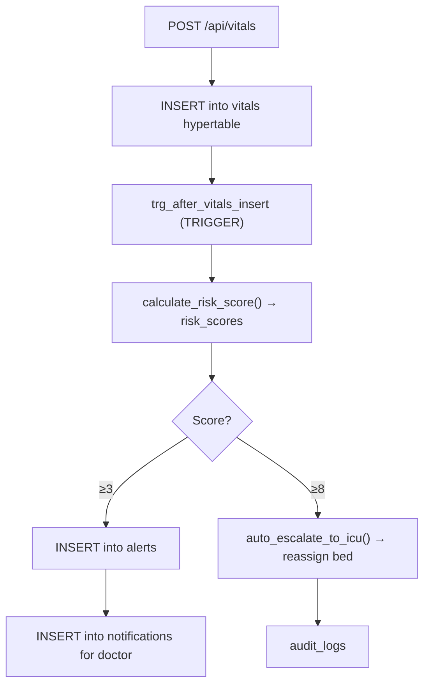

# Clinical Decision Support Backend — Walkthrough

## What Was Built

A complete **Node.js (Express) backend** for the Hospital Intelligence System inside `backend/`.

---

## Directory Structure

```
backend/
├── .env.example             ← DB + JWT config template
├── .gitignore
├── package.json             ← scripts: start, dev, migrate
└── src/
    ├── server.js            ← Express entry point
    ├── config/
    │   └── db.js            ← pg.Pool connection
    ├── middleware/
    │   ├── auth.js          ← JWT verification
    │   ├── rbac.js          ← Role-based access control
    │   └── errorHandler.js  ← Centralized error handler
    ├── db/
    │   ├── migrate.js       ← Migration runner script
    │   ├── migrations/      ← 10 SQL migration files
    │   └── functions/       ← 6 trigger/stored procedure files
    └── routes/              ← 9 Express route files
```

---

## Schema Overview (10 Tables)

| Table | Purpose |
|-------|---------|
| `departments` | Hospital departments |
| `doctors` | Staff with role + bcrypt password |
| `patients` | Patient demographics |
| `wards` | Ward classification (ICU, general, etc.) |
| `beds` | Bed availability tracking |
| `admissions` | Admission records linking patient→doctor→bed |
| `vitals` | **TimescaleDB hypertable** — time-series vitals |
| `risk_scores` | Computed 0–10 risk scores per admission |
| `alerts` | Clinical alerts with severity + acknowledgement |
| `notifications` | Doctor inbox |
| `audit_logs` | Immutable JSONB audit trail |

---

## Database Intelligence (Triggers & Stored Procedures)



| File | Intelligence |
|------|-------------|
| [001_risk_score_procedure.sql](file:///home/ashwin/Documents/GitHub/Clinical-Database-Intelligence/backend/src/db/functions/001_risk_score_procedure.sql) | Scores HR, BP, SpO2, Temp → 0-10 composite |
| [002_vitals_trigger.sql](file:///home/ashwin/Documents/GitHub/Clinical-Database-Intelligence/backend/src/db/functions/002_vitals_trigger.sql) | Fires on every vitals INSERT, orchestrates everything |
| [003_icu_escalation.sql](file:///home/ashwin/Documents/GitHub/Clinical-Database-Intelligence/backend/src/db/functions/003_icu_escalation.sql) | Finds free ICU bed, reassigns patient, logs action |
| [004_bed_trigger.sql](file:///home/ashwin/Documents/GitHub/Clinical-Database-Intelligence/backend/src/db/functions/004_bed_trigger.sql) | Keeps `beds.is_occupied` in sync with admissions |
| [005_discharge_suggestion.sql](file:///home/ashwin/Documents/GitHub/Clinical-Database-Intelligence/backend/src/db/functions/005_discharge_suggestion.sql) | Returns TRUE if last 3 risk scores ≤ 2 |
| [006_audit_trigger.sql](file:///home/ashwin/Documents/GitHub/Clinical-Database-Intelligence/backend/src/db/functions/006_audit_trigger.sql) | Captures full JSONB snapshots on patients/admissions/beds |

---

## API Endpoints

| Method | Path | Description |
|--------|------|-------------|
| GET | `/health` | Health check |
| POST/GET/PUT | `/api/patients` | Patient CRUD |
| POST/GET | `/api/doctors` | Doctor management |
| POST/GET | `/api/admissions` | Admit patient (triggers bed sync) |
| PUT | `/api/admissions/:id/discharge` | Discharge (frees bed via trigger) |
| GET | `/api/admissions/:id/discharge-ready` | Calls `suggest_discharge()` |
| POST | `/api/vitals` | Record vitals **(fires all DB triggers)** |
| GET | `/api/vitals/:patient_id` | Time-series query with date range |
| GET | `/api/vitals/:patient_id/latest` | Latest reading |
| GET | `/api/alerts` | Unacknowledged alerts |
| PUT | `/api/alerts/:id/acknowledge` | Acknowledge alert |
| GET | `/api/notifications` | Doctor inbox |
| GET | `/api/beds/availability` | Bed counts by ward |
| GET | `/api/icu/availability` | ICU bed summary |
| GET | `/api/dashboard/stats` | Aggregate stats panel |
| GET | `/api/audit-logs` | Paginated audit trail |

---

## Verification Results

```
✓ node --check on all 15 JS source files → ALL SYNTAX OK
✓ 31 files present across src/
✓ All npm dependencies installed (0 vulnerabilities)
```

---

## How to Run

### 1. Setup PostgreSQL with TimescaleDB
```bash
# Install TimescaleDB extension on your PostgreSQL instance
# https://docs.timescale.com/self-hosted/latest/install/
```

### 2. Configure .env
```bash
cd backend
cp .env.example .env
# Edit DATABASE_URL, JWT_SECRET
```

### 3. Run Migrations
```bash
npm run migrate
```

### 4. Start Server
```bash
npm run dev       # development (auto-reload)
npm start         # production
```

### 5. Smoke Test
```bash
# Health check
curl http://localhost:3001/health

# Create a patient
curl -X POST http://localhost:3001/api/patients \
  -H "Content-Type: application/json" \
  -d '{"name":"Jane Doe","date_of_birth":"1990-05-10","gender":"F"}'

# Record vitals (triggers risk score + alerts automatically)
curl -X POST http://localhost:3001/api/vitals \
  -H "Content-Type: application/json" \
  -d '{"admission_id":1,"heart_rate":145,"systolic_bp":185,"spo2":87,"temperature":39.9}'

# Check generated alerts
curl http://localhost:3001/api/alerts

# Dashboard stats
curl http://localhost:3001/api/dashboard/stats
```
